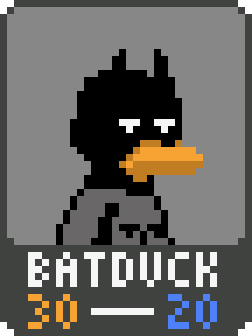
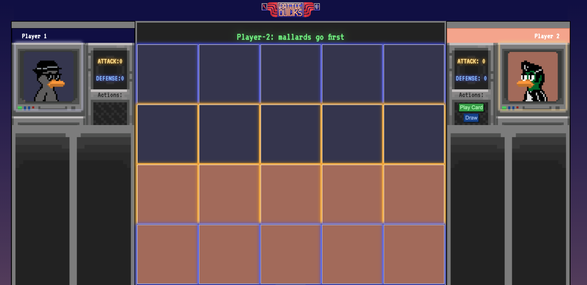

# **BATTLEDUCKS**
***
## Date: 03/07/2022

## By: Dylan Marvel

 ### [Github](https://github.com/marveldylan) | [Twitter](https://twitter.com/dmarv77) | [LinkedIn](https://www.linkedin.com/in/dylan-marvel/)
 ***
 
 ## ***PLAY NOW ON [SURGE.SH](https://battleducks-dm.surge.sh/)***
  &nbsp;
 ## ***DESCRIPTION***
 ### BATTLEDUCKS is a high-octane, turn-based, duck-themed card game for two players! Elements of BATTLEDUCKS are inspired by popular virtual and real-life card games, such as [GWENT: The Witcher Card Game](https://www.playgwent.com/en), [Epic Spell Wars](https://cryptozoic.com/collections/epic-spell-wars), and [Blackjack](https://en.wikipedia.org/wiki/Blackjack). Everyone knows that ducks are competitive creatures by nature, and we've gathered the coolest, best ducks around to compete in the fiery crucible that is BATTLEDUCKS!!!
 &nbsp;
## ***HOW TO PLAY***
### OVERVIEW: Players compete by playing DUCK cards, with the goal of attacking the other opponent. Each turn, a player can either lay a card or draw a card. Each DUCK card has an attack and defense stat. Laying a DUCK card in the attack row plays its attack stat, nullifying the defense stat. Similarly, laying a DUCK card in the defense row adds to player defense and does not contribute to attack. After 20 turns, attack and defense for each player is compared. Player 1 attack goes against Player 2 defense, and vice versa. Whichever player has the highest point differential (attack vs defense) wins!

 ### THE BOARD: The game board is split into 20 tiles, 10 for each player. On their turn, a player is able to lay a DUCK card on one of their tiles. The game board features an attack row and defense row. Attack row plays a card's attack, and defense plays a card's defense.
 &nbsp;
  ### THE DUCKS: What we're all here for. BATTLEDUCKS is played with DUCK cards, each with a unique name, image, and stats - in the future, some DUCKS even have special features that activate events throughout the game! Choose the best combination of DUCKS to lay in a round to defeat your opponent.
  &nbsp;

 ## ***Technologies***
 * HTML
 * CSS
    * Flexbox
    * Grid
* JavaScript
   * Event-Handlers
   * DOM Manipulation
   * Higher-Order Functions
   * Object Classes

## ***Screenshots***

### DUCKS

#### Bat Duck Card - 30 attack and 20 health.

### Game Board

#### Player 1 has laid three Regular Gray Ducks. Player 2 has laid two Regular Gray Ducks. Player 2 must play their final card to complete the round. Current score for each player is shown on their respective sides. Buttons added for viewing deck and selecting a current card to place.

## **Instructions for Developers**
* Fork and clone this repo
* Navigate to project folder
* Open index.html
  
## **Known Issues**
* Draw feature will replace current card ids and won't update on game board.
* If player hand is empty, draw feature will fill hand and allow to continue turn.
* Draw function may not end turn as it should - player is still able to lay cards after a draw (random at the moment).
* Back of card does  not render. Implemented hide feature for the time being.
* Card images may spill outside of game board tiles.
## ***Future Updates***
- [X] ~~Submit README.md~~
- [X] Create Game Board
- [X] Create Basic Game Assets for Testing Logic
- [X] Implement Game Initialization Logic
- [ ] ~~Implement Round Logic~~ (Changed to single round)
- [X] Create Win Conditions
- [ ] ~~Create Draw Conditions w/ HOLD card~~ (Omitted HOLD card mechanics)
- [X] Stylize Game and Assets
- [ ] Implement Classes and HOF to create new decks and add new cards quickly
- [ ] Add Extra DUCK Cards and Special Features

### **CHECK OUT MORE ON [TRELLO](https://trello.com/b/nj7qNTKf/project-1)**
&nbsp;

## ***Credits***
### **SITE / GAME BOARD MOCK-UPS BUILT WITH: [FIGMA](https://www.figma.com/)**
### **ASSET MOCK-UPS BUILT WITH: [PISKEL](https://www.piskelapp.com/) & [GRAVIT](https://www.designer.io/en/)**
### **FINAL SITE / GAME BOARD / CARD ASSETS  BUILT WITH: [PISKEL](https://www.piskelapp.com/), [GRAVIT](https://www.designer.io/en/) & [PROCREATE}(https://procreate.art/)**
### **MUSIC MADE WITH: [REASON COMPACT](https://www.reasonstudios.com/mobile-apps)**

