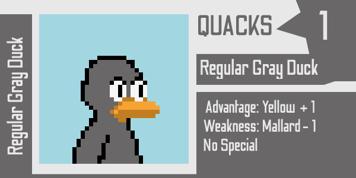
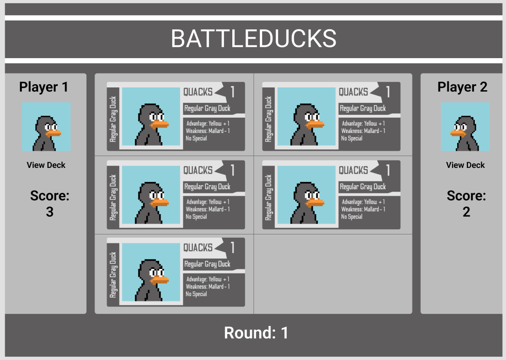

# **BATTLEDUCKS**
***
## Date: 03/07/2022

## By: Dylan Marvel

 ### [Github](https://github.com/marveldylan) | [Twitter](https://twitter.com/dmarv77) | [LinkedIn](https://www.linkedin.com/in/dylan-marvel/)
 ***
 ## ***DESCRIPTION***
 ### BATTLEDUCKS is a high-octane, turn-based, duck-themed card game for two players! Elements of BATTLEDUCKS are inspired by popular virtual and real-life card games, such as [GWENT: The Witcher Card Game](https://www.playgwent.com/en), [Epic Spell Wars](https://cryptozoic.com/collections/epic-spell-wars), and [Blackjack](https://en.wikipedia.org/wiki/Blackjack). Everyone knows that ducks are competitive creatures by nature, and we've gathered the coolest, best ducks around to compete in the fiery crucible that is BATTLEDUCKS!!!
 &nbsp;
## ***HOW TO PLAY***
### OVERVIEW: Players compete by playing DUCK cards, with the goal of scoring the most QUACKS in a round. The player who scores the most QUACKS for two rounds is declared the winner. Gameplay continues for a maximum of 3 rounds; in the event of a final-round draw, the player whose HOLD CARD has the highest number of QUACKS wins the game.
&nbsp;
 ### THE BOARD: The game board is split into 6 tiles, three for each player. On their turn, a player is able to lay a DUCK card on one of their tiles.
 &nbsp;
###  THE RULES: To begin, players draw ten cards to use as their deck for the duration of the game.  At the beginning of each round, players take turns sequentially laying down three DUCK cards of their choosing on their side of the board. The tile is chosen sequentially, thus, on Player 1's first turn in a round, they can only lay a card in Tile 1. Play continues to Player 2's first turn, at which time they lay a card in Tile 2. Play continues until Player 2 lays the last card in Tile 6, at which time points are added and special features considered to give the final QUACKS per player. The player with the most QUACKS wins the round.
 &nbsp;
  ### THE DUCKS: What we're all here for. BATTLEDUCKS is played with DUCK cards, each with a unique name, image, and QUACK level - some DUCKS even have special features that activate events throughout the game! Choose the best combination of DUCKS to lay in a round to defeat your opponent - but remember, your deck lasts the entirety of the game!
  &nbsp;
  ### THE HOLD CARD: Players are dealt ten cards at the beginning of a game, but only play nine cards throughout the maximum duration of 3 rounds. The remaining DUCK is the HOLD CARD, and is used in the event of a 3-round draw. Whichever HOLD CARD has a higher number of QUACKS wins the game.
&nbsp;
 ## ***Technologies***
 * HTML
 * CSS
    * Flexbox
    * Grid
* JavaScript
   * Event-Handlers
   * DOM Manipulation
   * Higher-Order Functions
   * Object Classes

## ***Screenshots***

### DUCK Card

#### Regular Gray DUCK Card. Has + 1 advantage over Yellow DUCKS, - 1 weakness from Mallard DUCKS.

### Game Board

#### Player 1 has laid three Regular Gray Ducks. Player 2 has laid two Regular Gray Ducks. Player 2 must play their final card to complete the round. Current score for each player is shown on their respective sides. Buttons added for viewing deck and selecting a current card to place.

## ***Future Updates***
- [X] ~~Submit README.md~~
- [ ] Create Game Board
- [ ] Create Basic Game Assets for Testing Logic
- [ ] Implement Game Initialization Logic
- [ ] Implement Round Logic
- [ ] Create Win Conditions
- [ ] Create Draw Conditions w/ HOLD card
- [ ] Stylize Game and Assets
- [ ] Add Extra DUCK Cards and Special Features

### **CHECK OUT MORE ON [TRELLO](https://trello.com/b/nj7qNTKf/project-1)**
&nbsp;

## ***Credits***
### **SITE / GAME BOARD MOCK-UPS BUILT WITH: [FIGMA](https://www.figma.com/)**
### **ASSET MOCK-UPS BUILT WITH: [PISKEL](https://www.piskelapp.com/) & [GRAVIT](https://www.designer.io/en/)**
